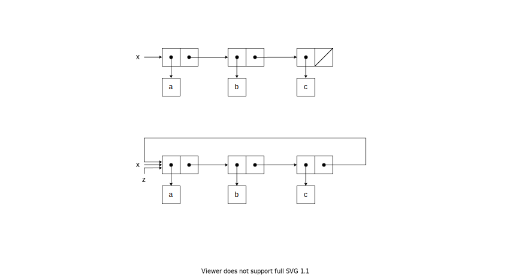

# Exercise 3.13

Consider the following make-cycle procedure, which uses the last-pair procedure
defined in exercise
3.12:

```scheme
(define (make-cycle x)
  (set-cdr! (last-pair x) x)
  x)
```

Draw a box-and-pointer diagram that shows the structure z created by

```scheme
(define z (make-cycle (list 'a 'b 'c)))
```



What happens if we try to compute `(last-pair z)`?

- Trying to compute `(last-pair z)` may cause an infinite loop.
