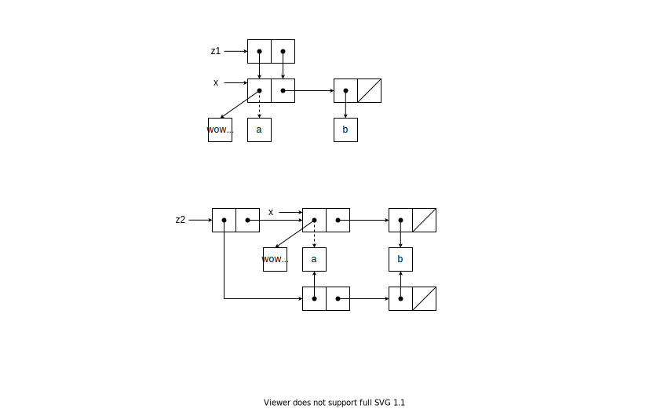

# Exercise 3.15

Draw box-and-pointer diagrams to explain the effect of set-to-wow! on the structures z1 and z2 
above.

```scheme
(define x (list 'a 'b))
(define z1 (cons x x))
(define z2 (cons (list 'a 'b) (list 'a 'b)))
(define (set-to-wow! x)
  (set-car! (car x) 'wow)
  x)

z1 ;; ((a b) a b)
(set-to-wow! z1) ;; ((wow b) wow b)
z2 ;; ((a b) a b)
(set-to-wow! z2) ;; ((wow b) a b)
```


