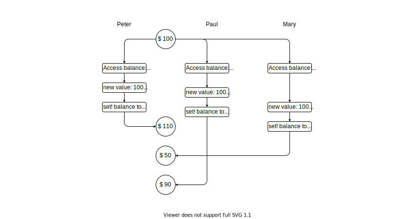
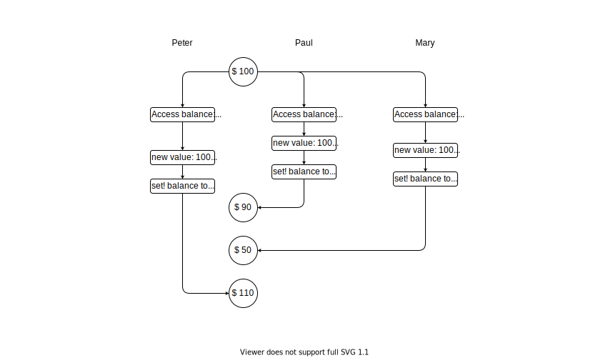

# Exercise 3.38

Suppose that Peter, Paul, and Mary share a joint bank account that initially
contains $100. Concurrently, Peter deposits $10, Paul withdraws $20, and Mary
withdraws half the money in the account, by executing the following commands:

Peter: `(set! balance (+ balance 10))`

Paul: `(set! balance (- balance 20))`

Mary: `(set! balance (- balance (/ balance 2)))`

a. List all the different possible values for balance after these three
transactions have been completed, assuming that the banking system forces the
three processes to run sequentially in some order.

b. What are some other values that could be produced if the system allows the
processes to be interleaved? Draw timing diagrams like the one in figure 3.29 to
explain how these values can occur.

#

## a.

- `balance = 35`

- `balance = 40`

- `balance = 45`

- `balance = 50`

## b.

- ### 50:
    

- ### 90:
    

- ### 110:
    