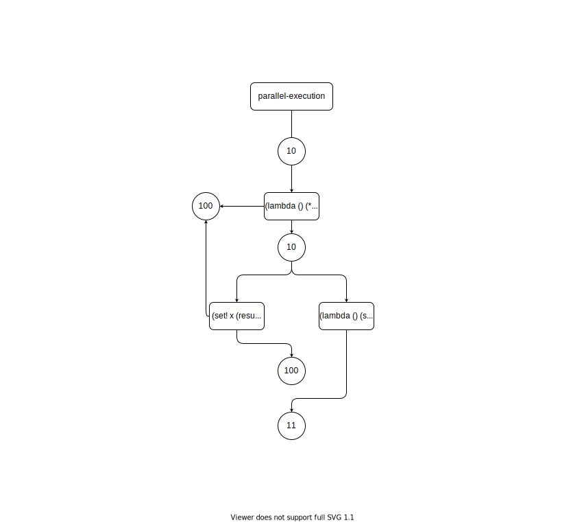
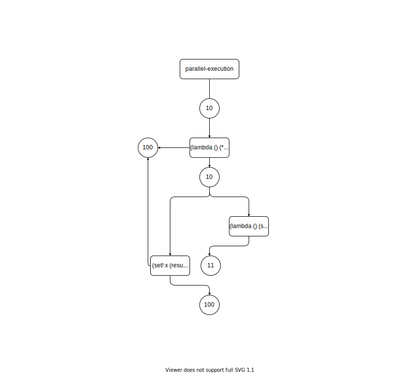
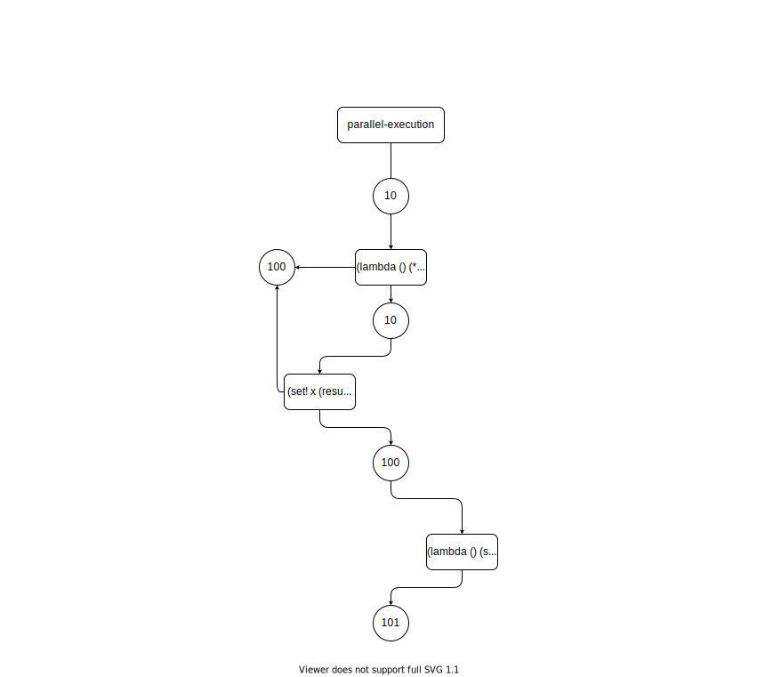
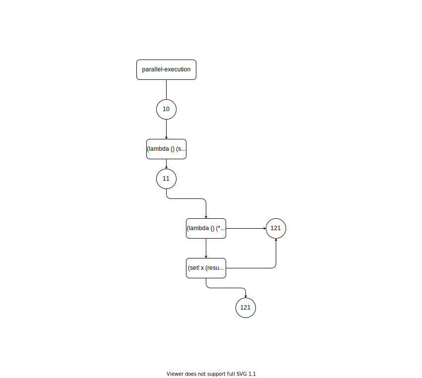

# Exercise 3.39

Which of the five possibilities in the parallel execution shown above remain if
we instead serialize execution as follows:

```scheme
(define x 10)

(define s (make-serializer))

(parallel-execute (lambda () (set! x ((s (lambda () (* x x))))))
                  (s (lambda () (set! x (+ x 1)))))
```

#

## 11: 



## 100:



## 101:



## 121:


